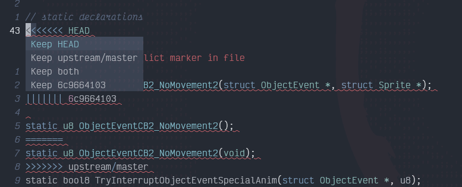

# Merge Conflict Assistant

This is a language server implementation to assist with resolving merge conflicts in files. The conflicts
in a file will be returned as Diagnostics and show as errors like any other syntax error. Code Actions for
these are made available which will show the branch, tag, or whatever name is included in the conflict
markers.



# Features

The names shown are based on the conflict markers. If branch names or hashes are included like git does
that is what you will see in the list. You choose which portion you want to keep. There is also a
"drop all" option which removes the marker and all of the impacted code completely. No worries, it
is an editor undo away if you decided you choose poorly.

The conflicts are marked as errors which means your editor should let you easily jump between the conflicts.

# Install

Build. Copy it somewhere in your path. Then add the tool to you editor as a language server.

## Helix

Add the following to languages.toml
```
[language-server.merge-conflict-assistant]
command = "merge-conflict-assistant"
```

Now you can put the "merge-conflict-assistant" into the list of language servers for whatever languages you want to use it in.
!NOTE! Always add it after the main LSPs for the language. This ensures the main LSP catches and flags warnings and errors.

As an example for Rust you want

```
language-servers = ["rust-analyzer", "merge-conflict-assistant"]
```
