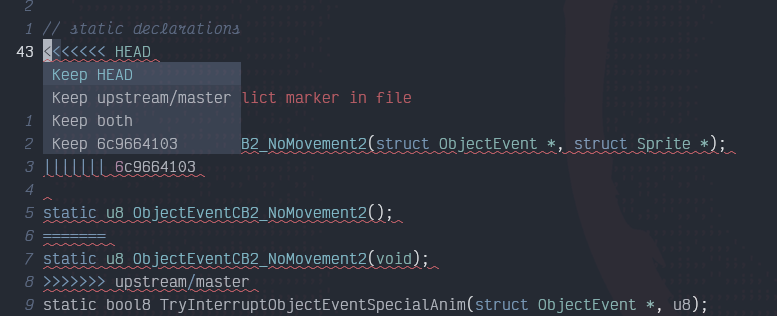

# Merge Conflict Assistant

This is a language server implementation to assist with resolving merge conflicts in files. The conflicts
in a file will be returned as Diagnostics and show as errors like any other syntax error. Code Actions for
these are made available which will show the branch, tag, or whatever name is included in the conflict
markers.



# Features

The names shown are based on the conflict markers. If branch names or hashes are included like git does
that is what you will see in the list. You choose which portion you want to keep. There is also a
"drop all" option which removes the marker and all of the impacted code completely. No worries, it
is an editor undo away if you decided you chose poorly.

The conflicts are marked as errors which means your editor should let you easily jump between the conflicts.

# Conflict Marker Formats

## Diff3

The server detects the standard two-way conflict marker format and its diff3 variant with an
ancestor (`|||||||`) section:

```
    <<<<<<< HEAD
    your changes
    ||||||| original
    ancestor content
    =======
    incoming changes
    >>>>>>> branch-name
```

Code actions: `Keep HEAD`, `Keep branch-name`, `Keep ancestor` (diff3 only), `Keep both`,
and `Drop all`.

When a file contains two or more diff3 conflicts, two additional file-wide actions are offered
alongside the per-site ones: `Keep HEAD in remaining conflicts` and `Keep branch-name in
remaining conflicts`. They apply the corresponding choice to every diff3 conflict still in the
file in a single atomic edit. This enables a rebase workflow where the diagnostics are walked to
get the scope of the conflicts, any that need special work are resolved, and then the remaining
can be handled all at once with a "remaining conflicts" option.

## jj snapshot format

The server also detects jj snapshot conflicts, produced by Jujutsu VCS when configured with
`ui.conflict-marker-style = "snapshot"`. A snapshot conflict materializes each side of a conflict
as a complete content snapshot rather than as a diff:

```
    <<<<<<< conflict 1 of 1
    +++++++ rtsqusxu 2768b0b9 "commit A"
    apple
    grapefruit
    orange
    ------- vpxusssl 38d49363 "merge base"
    apple
    grape
    orange
    +++++++ ysrnknol 7a20f389 "commit B"
    APPLE
    GRAPE
    ORANGE
    >>>>>>> conflict 1 of 1 ends
```

Detection routes on the first marker inside the block: a `<<<<<<<` followed by `+++++++` is a
snapshot conflict; a `<<<<<<<` followed by `=======` or `|||||||` is a diff3-style conflict.

Code actions for each snapshot region:

- `Keep '<label>'` for each `+++++++` side (verbatim label from the marker line).
- `Keep '<label>'` for each `-------` base (one action per base; a conflict with N sides has N−1 bases).
- `Keep all sides` — concatenates all side content in document order; base is omitted.
- `Drop all` — removes the entire conflict block.

**Limitation:** marker tokens must be exactly 7 characters (`<<<<<<<`, `+++++++`, `-------`,
`>>>>>>>`). Runs of 8 or more identical characters are treated as file content, not markers. jj
can emit longer markers when 7-character sequences appear in file content; if your codebase
triggers this, open an issue.

## Mixed-format files

A file containing both a diff3-style conflict block and a jj snapshot conflict block produces a
single error diagnostic at the opening line of the second (conflicting-style) block. No code
actions are offered for any conflict in the file.

# Install

Build. Copy it somewhere in your path. Then add the tool to you editor as a language server.

## Helix

Add the following to languages.toml
```
[language-server.merge-conflict-assistant]
command = "merge-conflict-assistant"
```

Now you can put the "merge-conflict-assistant" into the list of language servers for whatever languages you want to use it in.
!NOTE! Always add it after the main LSPs for the language. This ensures the main LSP catches and flags warnings and errors.

As an example for Rust you want

```
language-servers = ["rust-analyzer", "merge-conflict-assistant"]
```

## NixOS / Home Manager

A Home Manager module is provided via the flake output `homeManagerModules.helix`.

### Flake Input

Add the following to your flake inputs:

```nix
merge-conflict-assistant = {
  url = "github:shaleh/merge-conflict-assistant";
  inputs.nixpkgs.follows = "nixpkgs";
};
```

### Module Setup

Add the module to your Home Manager `sharedModules`:

```nix
home-manager.sharedModules = [
  inputs.merge-conflict-assistant.homeManagerModules.helix
];
```

The module automatically sets the `command` for the language server when
`programs.helix.enable = true`, so no manual `languages.toml` configuration
is needed for the server definition.

### Language Configuration

You still need to add `merge-conflict-assistant` to the language servers for
whichever languages you want to use it with.

In your Home Manager config:

```nix
programs.helix.languages = {
  language = [
    {
      name = "rust";
      language-servers = [ "rust-analyzer" "merge-conflict-assistant" ];
    }
  ];
};
```

As noted above, always add `merge-conflict-assistant` after the primary LSP for the language.
